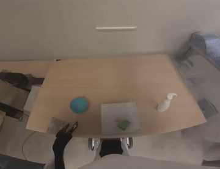
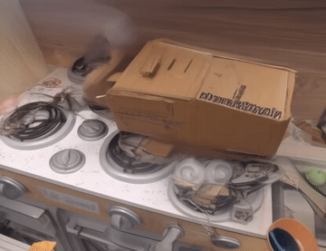

<h1 align="center">Reward as An Agent for Embodied World Models</h1>

<p align="center">
  <a href="https://arxiv.org/abs/2606.19990">📄 Paper</a> |
  <a href="#quick-start">🚀 Quick Start</a> |
  <a href="#demo-videos">🎬 Demo</a> |
  <a href="#api">🧩 API</a> |
  <a href="#citation">📝 Citation</a>
</p>

---

Reward as An Agent for Embodied World Models addresses a key bottleneck in
RL-based world-model post-training: broader rollout exploration is useful only
when rewards can reliably reject reward hacking. The paper treats reward
computation as agentic verification, where generated robot rollouts are judged
for planning feasibility, visual quality, physical plausibility, instruction
alignment, and task completion.

This repository provides the open-source reward-agent service for evaluating
embodied rollout videos with an OpenAI-compatible multimodal LLM.

## News

- **2026-06-30**: Initial open-source release of Reward as An Agent for Embodied World Models.

## Framework

<p align="center">
  
</p>

The framework follows a verification-first reward design:

- Use a planning gate to filter obviously invalid rollouts.
- Judge visual quality and embodied physical plausibility before task scoring.
- Check instruction/background consistency and final task completion separately.
- Keep each reward dimension interpretable to reduce reward hacking under broader rollout exploration.

Motion-quality metrics are reserved for future integration and are not included
in the current open-source score.

## TODO

- Integrate more model-based rewards for embodied world-model evaluation.
- Add optional non-LLM motion-quality rewards after public dependency cleanup.

## Quick Start

Create an environment:

```bash
bash scripts/setup_env.sh
```

Or install into an existing Python 3.10+ environment:

```bash
python -m pip install -e .
```

Configure the model endpoint:

```bash
cp .env.example .env
```

Start the service:

```bash
bash scripts/run_reward_as_agent.sh
```

To start it in the background and write logs under `REWARD_AS_AGENT_LOG_ROOT`:

```bash
bash scripts/start_background.sh
```

Equivalent:

```bash
python -m reward_as_agent.cli serve
```

After installation, the console command is available:

```bash
reward-as-agent serve
reward-as-agent --version
```

## Evaluation

Using the CLI:

```bash
python -m reward_as_agent.cli eval \
  --url http://127.0.0.1:7024/eval_video \
  --prompt "A first-person dual-arm robot picks up the red cube and places it into the bowl." \
  --video /absolute/path/to/video_0.mp4 \
  --video /absolute/path/to/video_1.mp4
```

Using `curl`:

```bash
curl -N http://127.0.0.1:7024/eval_video \
  -H "Content-Type: application/json" \
  -d @examples/demo_01/request.json
```

Example streamed response:

```jsonl
{"index":0,"score":1.0,"status":"success"}
```

## Demo Videos

The repository includes five small demo rollouts under `examples/`:

| Demo | Preview | Reward output |
| --- | --- | --- |
| Cloth manipulation | [](examples/demo_01/video_1.mp4)<br>[MP4](examples/demo_01/video_1.mp4) | `{"index": 0, "score": 1.0, "status": "success"}` |
| Refrigerator drawer opening | [](examples/demo_02/video_1.mp4)<br>[MP4](examples/demo_02/video_1.mp4) | `{"index": 0, "score": 1.0, "status": "success"}` |
| Basket handle grasping | [](examples/demo_03/video_0.mp4)<br>[MP4](examples/demo_03/video_0.mp4) | `{"index": 0, "score": 0.7, "status": "success"}` |
| Green cube placing | [](examples/demo_04/video_0.mp4)<br>[MP4](examples/demo_04/video_0.mp4) | `{"index": 0, "score": 0.384, "status": "success"}` |
| Failed box relocation | [](examples/demo_05/video_0.mp4)<br>[MP4](examples/demo_05/video_0.mp4) | `{"index": 0, "score": 0, "status": "success"}` |

Prompt and request files:

| Demo | Prompt | Request |
| --- | --- | --- |
| Cloth manipulation | `examples/demo_01/prompt.txt` | `examples/demo_01/request.json` |
| Refrigerator drawer opening | `examples/demo_02/prompt.txt` | `examples/demo_02/request.json` |
| Basket handle grasping | `examples/demo_03/prompt.txt` | `examples/demo_03/request.json` |
| Green cube placing | `examples/demo_04/prompt.txt` | `examples/demo_04/request.json` |
| Failed box relocation | `examples/demo_05/prompt.txt` | `examples/demo_05/request.json` |

The demo results above were verified with the reward model served by vLLM using
`--max-model-len 65536`, which is required by the 64-frame physics/motion reward
stage:

```bash
# Activate an environment with vLLM installed, for example:
# conda activate your-vllm-env
export MODEL_PATH=/path/to/your/reward-model
CUDA_VISIBLE_DEVICES=3 python -m vllm.entrypoints.openai.api_server \
  --model "$MODEL_PATH" \
  --served-model-name "$MODEL_PATH" \
  --trust-remote-code \
  --host 127.0.0.1 \
  --port 7000 \
  --dtype bfloat16 \
  --gpu-memory-utilization 0.95 \
  --max-model-len 65536
```

Run them against a local service:

```bash
curl -N http://127.0.0.1:7024/eval_video \
  -H "Content-Type: application/json" \
  -d @examples/demo_01/request.json

curl -N http://127.0.0.1:7024/eval_video \
  -H "Content-Type: application/json" \
  -d @examples/demo_02/request.json

curl -N http://127.0.0.1:7024/eval_video \
  -H "Content-Type: application/json" \
  -d @examples/demo_03/request.json

curl -N http://127.0.0.1:7024/eval_video \
  -H "Content-Type: application/json" \
  -d @examples/demo_04/request.json

curl -N http://127.0.0.1:7024/eval_video \
  -H "Content-Type: application/json" \
  -d @examples/demo_05/request.json
```

## Configuration

Important variables:

```bash
REWARD_AS_AGENT_API_BASE=http://localhost:7000/v1
REWARD_AS_AGENT_API_KEY=dummy
REWARD_AS_AGENT_MODEL=/path/to/your/reward-model
REWARD_AS_AGENT_PORT=7024
REWARD_AS_AGENT_LOG_ROOT=./runs
```

| Variable | Example | Description |
| --- | --- | --- |
| `REWARD_AS_AGENT_API_BASE` | `http://localhost:7000/v1` | OpenAI-compatible `/v1` endpoint. |
| `REWARD_AS_AGENT_API_KEY` | `dummy` | Bearer token sent to the model server. |
| `REWARD_AS_AGENT_MODEL` | `/path/to/your/reward-model` | Model name/path passed in chat-completions requests. |
| `REWARD_AS_AGENT_HOST` | `0.0.0.0` | FastAPI bind host. |
| `REWARD_AS_AGENT_PORT` | `7024` | FastAPI bind port. |
| `REWARD_AS_AGENT_LOG_ROOT` | `./runs` | Directory for copied inputs and detailed judge logs. |
| `REWARD_AS_AGENT_SAVE_INPUTS` | `true` | Copy submitted videos and prompts into `REWARD_AS_AGENT_LOG_ROOT`. |
| `REWARD_AS_AGENT_LLM_TIMEOUT` | `600` | LLM request timeout in seconds. |
| `REWARD_AS_AGENT_MAX_RETRIES` | `10` | Maximum retry count for invalid or unparsable judge JSON. |
| `REWARD_AS_AGENT_ENABLE_MOTION_QUALITY` | `false` | Reserved for future non-LLM motion-quality rewards. |
| `REWARD_AS_AGENT_MOTION_QUALITY_PATH` | empty | Reserved path for future motion-quality integrations. |

## API

`GET /health`

Returns service configuration and optional metric availability:

```json
{
  "status": "ok",
  "model": "/path/to/your/reward-model",
  "motion_quality_enabled": false,
  "motion_quality_available": false
}
```

`POST /eval_video`

Request body:

```json
{
  "video_path": ["/absolute/path/to/video_0.mp4"],
  "prompt": "Task description shared by the videos."
}
```

Response: `application/jsonl`, one object per completed video:

```json
{"index": 0, "score": 1.0, "status": "success"}
```

## Repository Layout

```text
.
├── reward_as_agent/
│   ├── app.py              # FastAPI routes and JSONL streaming
│   ├── pipeline.py         # reward-stage orchestration
│   ├── prompts.py          # LLM judge prompts
│   ├── scoring.py          # JSON-to-score reducers
│   ├── video.py            # video decoding and frame formatting
│   ├── llm.py              # OpenAI-compatible model client
│   ├── logging.py          # input/result persistence
│   ├── config.py           # environment-backed settings
│   └── cli.py              # reward-as-agent command line interface
├── reward_main.py          # compatibility entrypoint for local uvicorn runs
├── assets/                 # README figures
├── scripts/                # setup, launch, and smoke-test scripts
├── examples/               # example request payloads
├── tests/                  # smoke tests for config, API, and helpers
└── pyproject.toml          # installable Python package metadata
```

## Development

```bash
python -m compileall reward_as_agent reward_main.py scripts tests
python -m pytest -q
python -m reward_as_agent.cli --help
```

The repository includes a GitHub Actions workflow in `.github/workflows/ci.yml`
that runs these checks on Python 3.10 and 3.11.

If your global Python already has OpenCV installed against NumPy 1.x, importing
`cv2` with NumPy 2.x may fail. The provided dependencies pin `numpy<2`; rebuild
the environment with `bash scripts/setup_env.sh` if you hit an OpenCV/NumPy ABI
error while decoding videos.

## Citation

If this code helps your work, please cite the paper:

```bibtex
@misc{li2026rewardagentembodiedworld,
      title={Reward as An Agent for Embodied World Models}, 
      author={Pu Li and Zhigang Lin and Qiang Wu and Yongxuan Lv and Fei Wang and Shan You},
      year={2026},
      eprint={2606.19990},
      archivePrefix={arXiv},
      primaryClass={cs.AI},
      url={https://arxiv.org/abs/2606.19990}, 
}
```
