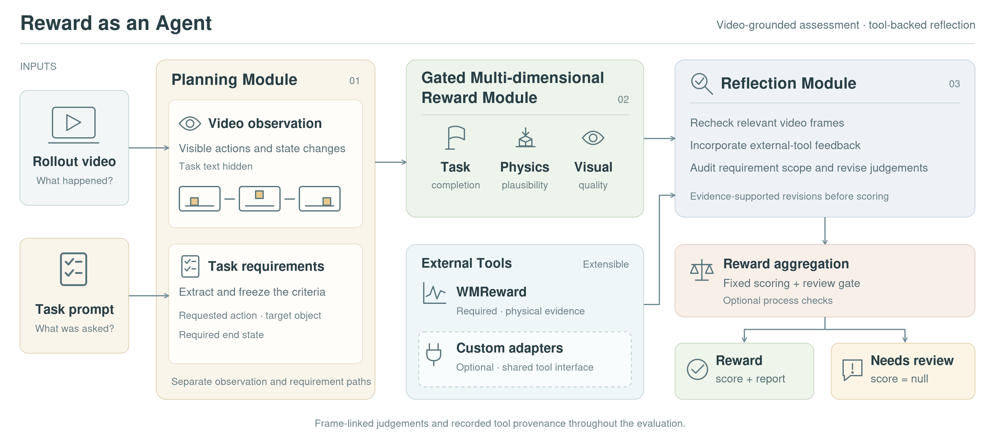
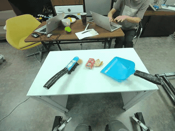
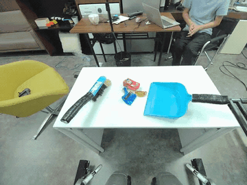
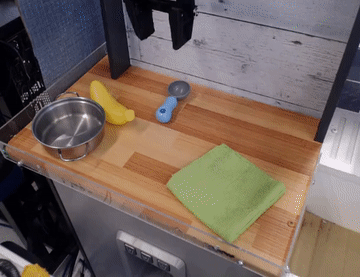
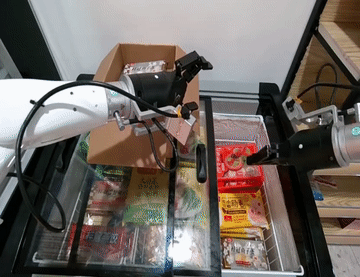
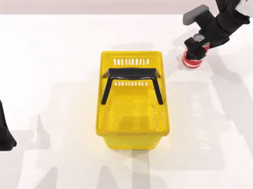
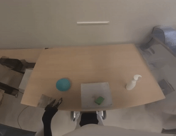
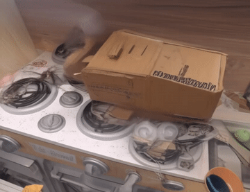

<h1 align="center">Reward as An Agent for Embodied World Models</h1>

<p align="center">
  <a href="https://arxiv.org/abs/2606.19990">📄 Paper</a> |
  <a href="#quick-start">🚀 Quick Start</a> |
  <a href="#demo-videos">🎬 Demo</a> |
  <a href="#api">🧩 API</a> |
  <a href="#citation">📝 Citation</a>
</p>

A multimodal reward-agent service for embodied world-model rollouts, evaluating
task progress, physical plausibility, and visual quality with traceable evidence.

## What's included

- Doubao/Volcengine Ark and OpenAI-compatible backends.
- Frame-cited assessments, frozen task requirements, and visual reflection.
- Progress-aware task judgement, separate training/diagnostic scores, and review handling.
- Streaming API, bounded concurrency, caching, and a WMReward external-tool adapter.

## Framework

<p align="center">
  
</p>

- **Evidence and verification:** task-blind observations and frozen requirements feed frame-cited assessment, followed by refined-frame verification.
- **Tools and scope audit:** the default service and both demo runners require real WMReward evidence for reflection; requirement audits preserve prerequisites and remove unsupported conditions.
- **Reward contract:** configured process/completion gates precede the training-reward decision. Evidence-backed decisive failure returns zero; unresolved cases return `null`. Diagnostic scores remain separate.

The HTTP service starts with WMReward enabled and requires tool-backed Reflection.
Additional process gates remain configurable. Custom
adapters and SAM2/CoTracker experiments are not enabled by default.

[Editable framework (SVG)](assets/reward_as_agent_framework.svg).

## Quick Start

Install with Python 3.10+ and configure your model endpoint and credentials:

```bash
python -m pip install -e .
cp .env.example .env
# Edit .env for the model endpoint, credentials, and REWARD_WMREWARD_* paths.
python -m reward_as_agent.cli serve
```

This starts the full Agent with a resident WMReward worker. First follow
[WMReward deployment](#wmreward-external-tool-deployment) and configure the five
`REWARD_WMREWARD_*` values in [.env.example](.env.example). Startup validates the
configuration and loads the checkpoint before accepting requests. Missing tools
or failed worker initialization stop startup; evaluation never silently falls
back to a model-only reward. Tool/Reflection failures return an API error.

Alternatively, use `bash scripts/setup_env.sh` to create an environment.
See [.env.example](.env.example) for configuration and
[config.py](reward_as_agent/config.py) for defaults.

For the Ark/Doubao profile used by the demos, configure Ark credentials and any
required outbound proxy, then use the settings below.

<details>
<summary>Demo service configuration</summary>

```bash
env -u REWARD_TASK_CONTRACT_REGISTRY -u REWARD_AS_AGENT_TEMPERATURE \
REWARD_AS_AGENT_PROVIDER=doubao \
REWARD_AS_AGENT_API_BASE=https://ark.cn-beijing.volces.com/api/v3 \
REWARD_AS_AGENT_MODEL=doubao-seed-2-1-pro-260628 \
REWARD_AS_AGENT_HOST=127.0.0.1 REWARD_AS_AGENT_PORT=7024 \
REWARD_AS_AGENT_MAX_TOKENS=8192 REWARD_AS_AGENT_LLM_TIMEOUT=240 \
REWARD_AS_AGENT_MAX_RETRIES=2 REWARD_EVIDENCE_FRAMES=32 \
REWARD_REQUIREMENT_AUDIT_MODE=joint REWARD_GATE_POLICY=off \
REWARD_PHYSICS_COMPLETION=required REWARD_AS_AGENT_CACHE_BYPASS=1 \
python -m reward_as_agent.cli serve
```

</details>

## Demo Videos

The seven main-table response files are model-only outputs, not tool-backed
evaluations. Only the separately linked cloth WMReward run includes real tool
Reflection; the gallery has not yet been rerun with tools. To run
the current standard path, use the WMReward command below; it evaluates every
case with external-tool Reflection and writes a fresh, auditable result set.
Videos and task texts are unchanged.

| Demo / video | Final assessments | API result / full report |
| --- | --- | --- |
| **Sweep a carton and peel · real robot**<br>[](examples/demo_06/video.mp4)<br>[Full MP4 · 37.3 s](examples/demo_06/video.mp4) | Task: `complete`<br>Physics: `plausible`<br>Visual: `clear` | **1.0** · `success`<br>The carton and peel are swept into the dustpan and remain inside.<br>[Response + trace](examples/demo_06/response.json) · [Run](examples/demo_06/run.json) · [Source](examples/demo_06/source.json) |
| **Sweep several pieces of litter · real robot**<br>[](examples/demo_07/video.mp4)<br>[Full MP4 · 42.0 s](examples/demo_07/video.mp4) | Task: `complete`<br>Physics: `plausible`<br>Visual: `clear` | **1.0** · `success`<br>The carton, blue packaging, and brown scrap remain in the dustpan at the end.<br>[Response + trace](examples/demo_07/response.json) · [Run](examples/demo_07/run.json) · [Source](examples/demo_07/source.json) |
| **Cloth manipulation**<br>[](examples/demo_01/video_1.mp4)<br>[MP4](examples/demo_01/video_1.mp4) | Task: `partial`<br>Physics: `plausible`<br>Visual: `clear` | **0.615** · `success`<br>Recorded model output; its rationale credits approach/contact without establishing effective cloth displacement. This remains a known progress-classification inconsistency, not a validated correct label.<br>[Response + trace](examples/demo_01/response.json) · [Run metadata](examples/demo_01/run.json) |
| **Refrigerator drawer opening**<br>[](examples/demo_02/video_1.mp4)<br>[MP4](examples/demo_02/video_1.mp4) | Task: `partial`<br>Physics: `plausible`<br>Visual: `clear` | **0.615** · `success`<br>The drawer is pulled open; handle release and the other arm's stationary condition are unmet.<br>[Response + trace](examples/demo_02/response.json) · [Run metadata](examples/demo_02/run.json) |
| **Basket handle grasping**<br>[](examples/demo_03/video_0.mp4)<br>[MP4](examples/demo_03/video_0.mp4) | Task: `partial`<br>Physics: `plausible`<br>Visual: `minor_degradation` | **0.595** · `success`<br>The can-lowering action is credited, but the subsequent handle grasp is unmet. Physical continuity judgement varied between runs; this output is not ground truth.<br>[Response + trace](examples/demo_03/response.json) · [Run metadata](examples/demo_03/run.json) |
| **Green cube placing**<br>[](examples/demo_04/video_0.mp4)<br>[MP4](examples/demo_04/video_0.mp4) | Task: `failed`<br>Physics: `plausible`<br>Visual: `minor_degradation` | **0** · `success`<br>The visible sequence is static; grasping and placement are not performed.<br>Diagnostic score: 0.28.<br>[Response + trace](examples/demo_04/response.json) · [Run metadata](examples/demo_04/run.json) |
| **Box relocation**<br>[](examples/demo_05/video_0.mp4)<br>[MP4](examples/demo_05/video_0.mp4) | Task: `failed`, medium confidence<br>Physics: `plausible`<br>Visual: `minor_degradation` | **null** · `needs_review`<br>The report describes no box movement, but medium task confidence and unresolved gripper/other-arm evidence prevent a confirmed training zero. This conservative inconsistency remains unresolved.<br>[Response + trace](examples/demo_05/response.json) · [Run metadata](examples/demo_05/run.json) |

These are recorded Agent outputs, not ground-truth labels or a calibrated benchmark.
Known limitations include the cloth's inconsistent progress rationale, variable
basket physics judgements, and conservative review of the static box.

The two 1.0 examples are **real-robot recordings**, selected using existing success
annotations that were not supplied to the Agent. Their previews run at **3× speed**;
evaluation used the original full-duration videos.

### Run the demos

Each `examples/demo_XX/` contains the video, `prompt.txt`, and request payload.
With the default service running, evaluate all seven cases with tools:

```bash
python scripts/run_demos.py --output runs/my_tool_demos --jobs 2
```

The runner rejects services without required WMReward Reflection and checks
every result for actual tool completion, matching video identity, and a
successful Reflection trace. A standalone alternative (no HTTP service) is:

```bash
python scripts/run_wmreward_demo.py \
  --output runs/my_wmreward_demos \
  --worker-python /path/to/cuda-environment/bin/python \
  --wmreward-repo /path/to/WMReward \
  --checkpoint /path/to/vitg.pt \
  --checkpoint-sha256 67129f011434e605d894e69f2c8e13d9db118deabe59d54bf6e0fa62c2c5cb8e \
  --device cuda:0
```

Use a new output directory for each run; existing cases are never overwritten.
Both runners evaluate all bundled cases with WMReward Reflection. Repeat
`--demo demo_XX` to select a subset. The HTTP runner reuses the service worker;
the standalone runner currently reloads the model for each case.

### WMReward external-tool deployment

WMReward is the standard physical-evidence worker for this repository. Every
standard evaluation calls it before Reflection; its raw value is retained as
evidence and is never converted directly into a task reward.

A separate live run on the cloth video returned **0.595 / partial** with
`reflection_applied: true`. WMReward's raw surprise was **0.4671045** over
49 sampled frames, without tool cache or fallback. Surprise is a tool signal,
not a task-success probability or final reward. Verdicts were unchanged across
reflection; this is not a controlled comparison with the default run.

[Response](examples/demo_01/wmreward/response.json) ·
[Tool output](examples/demo_01/wmreward/tools.json) ·
[Before/after reflection](examples/demo_01/wmreward/reports.json) ·
[Run metadata](examples/demo_01/wmreward/run.json)

<details>
<summary>Install and run WMReward</summary>

The worker requires a CUDA machine, Python 3.10, a WMReward checkout with its
`vjepa2` submodule, and the V-JEPA2 ViT-G checkpoint. WMReward's upstream
environment recommends PyTorch 2.4/CUDA 12.4; the verified experiment used a
CUDA-enabled Python environment with PyTorch 2.6.0, torchvision 0.21.0, and
decord 0.6.0. Use one environment consistently and validate it before a long
batch run.

```bash
git clone https://github.com/facebookresearch/WMReward.git
cd WMReward
git checkout f2af53737f64f12915f249f3ad18012e6afea1ba
git submodule update --init --recursive vjepa2
git -C vjepa2 rev-parse HEAD
# Expected: c2963a47433ecca0ad4f06ec28bcfa8cb5b5cefb
python3.10 -m venv .venv-worker
.venv-worker/bin/python -m pip install torch==2.6.0 torchvision==0.21.0 --index-url https://download.pytorch.org/whl/cu126
.venv-worker/bin/python -m pip install numpy==1.26.4 decord==0.6.0 diffusers==0.33.1 einops==0.8.1 pillow timm==1.0.20
.venv-worker/bin/python -c 'import torch, torchvision, decord; from utils import compute_vjepa_loss_sliding_window; assert torch.cuda.is_available(); print("Worker imports and CUDA OK")'
mkdir -p checkpoints
curl -L https://dl.fbaipublicfiles.com/vjepa2/vitg.pt -o checkpoints/vitg.pt
sha256sum checkpoints/vitg.pt
```

This scoring-only setup does not need MAGI-1 generator weights. The commands
mirror the existing experiment environment; a fresh installation has not been
retested here. See the [upstream installation guide](https://github.com/facebookresearch/WMReward#installation)
for the full generation environment. Use an NVIDIA driver compatible with the
selected PyTorch CUDA build. The checkpoint is about 16.5 GB; allow additional
disk space for dependencies and sufficient host RAM for loading it. The cloth
run recorded about 8.4 GiB peak PyTorch allocation, not a guaranteed memory
limit; reserve extra free GPU memory for other videos and CUDA overhead.

The expected checkpoint digest for the verified run is
`67129f011434e605d894e69f2c8e13d9db118deabe59d54bf6e0fa62c2c5cb8e`.
Do not skip the digest check: the worker records the checkpoint identity in
every tool result.

From the Reward Agent repository, configure Ark credentials/proxy and run:

```bash
env -u REWARD_TASK_CONTRACT_REGISTRY -u REWARD_AS_AGENT_TEMPERATURE \
REWARD_AS_AGENT_PROVIDER=doubao \
REWARD_AS_AGENT_API_BASE=https://ark.cn-beijing.volces.com/api/v3 \
REWARD_AS_AGENT_MODEL=doubao-seed-2-1-pro-260628 \
REWARD_AS_AGENT_MAX_TOKENS=8192 REWARD_AS_AGENT_LLM_TIMEOUT=240 \
REWARD_AS_AGENT_MAX_RETRIES=2 REWARD_EVIDENCE_FRAMES=32 \
REWARD_REQUIREMENT_AUDIT_MODE=joint REWARD_GATE_POLICY=off \
REWARD_PHYSICS_COMPLETION=required \
python scripts/run_wmreward_demo.py \
  --output runs/my_wmreward_demos \
  --worker-python /path/to/WMReward/.venv-worker/bin/python \
  --wmreward-repo /path/to/WMReward \
  --checkpoint /path/to/WMReward/checkpoints/vitg.pt \
  --checkpoint-sha256 67129f011434e605d894e69f2c8e13d9db118deabe59d54bf6e0fa62c2c5cb8e \
  --device cuda:0
```

The command runs every bundled demo through WMReward by default and saves each
case under `runs/my_wmreward_demos/demo_XX/`. Use repeated `--demo demo_XX`
options to select a subset. Each case contains the actual tool output, before
and after Reflection reports, trace, and provenance. Tool errors remain errors;
uncertain evaluations retain `score: null`.
Check `metadata.json`: require `tool_demo_completed: true`,
`reflection_applied: true`, and an empty `execution_errors` list before using a
result as tool-backed. A failed tool/reflection produces an error, not a usable
baseline score; **do not use error results for training**.
The runner exits nonzero on integration failure. GPU OOM requires more free
memory; missing imports require repairing the worker environment; checkpoint
mismatches require checking the download, not bypassing validation.

</details>

The runner starts and closes a local worker subprocess for each case (currently
sequential, with a fresh model load per case); no separate server or port is
needed. The two Python environments must share video and model paths. The
worker communicates through a validated JSONL
protocol. It verifies the input video hash before and after inference, rejects
unsupported query parameters, records `raw_score`, frame sampling, model
revision, and latency, then passes the result to image-grounded Reflection.
Errors and abstentions are recorded as such; they never become a synthetic
zero reward. For a single case, add `--demo demo_01`.

To integrate another tool, implement the JSONL worker contract in
[worker_client.py](scripts/frozen_v41/worker_client.py) and inject clients into
[PhysicsEvidenceHook](scripts/frozen_v41/physics_integration.py), then pass the
hook to `EvidencePipeline(settings, physics_hook=hook)`. Requests contain
`video_uri`, `video_sha256`, and an operation; results use `ok`, `error`, or
`abstain`, preserve source identity, and describe raw-score semantics. Only
successful matching-source evidence participates in Reflection. The existing
WMReward runner is the executable integration example; `scripts/frozen_v41/`
contains active adapters despite its historical directory name.

## Reward semantics

- **Partial progress:** effective task progress is visible, but requirements remain unmet.
  Mere approach, empty grasping, or ineffective contact does not establish progress.
- **Confirmed failure:** evidence-backed failure with no effective progress returns **0**.
  One unmet requirement alone does not erase existing progress.
- **Needs review:** unresolved evidence can affect the reward; returns `score: null`.
  Sampling gaps alone are not physical anomalies.
- **Diagnostics:** `diagnostic_score` retains the component-based soft score and
  diagnostic review reasons, separate from the training reward.

The soft rubric is `(0.70 task + 0.20 physics + 0.10 visual) × (0.5 + 0.5 physics)`.
Weights are provisional, not human-calibrated. See
[training_reward.py](reward_as_agent/training_reward.py) and
[evidence_schema.py](reward_as_agent/evidence_schema.py) for exact rules.

## API

`GET /health` reports `external_tools: ["wmreward"]`,
`tool_reflection_required: true`, and `tool_runtime_initialized: true` after
worker startup. A worker is shared and its GPU requests are serialized; Agent
requests can still overlap. `POST /eval_video` streams JSONL,
one result per video:

```bash
curl -N http://127.0.0.1:7024/eval_video \
  -H "Content-Type: application/json" \
  -d '{"video_path":["/absolute/path/video.mp4"],"prompt":"Place the cube in the bowl.","return_details":true}'
```

Typical result fields:

```json
{"index":0,"score":0.615,"status":"success","task_verdict":"partial","training_eligible":true,"diagnostic_score":0.615}
```

`success` means evaluation completed, not task success. `return_details: true`
adds evidence and trace; diagnostic review fields are also available.
A review result has `status: needs_review`, `score: null`, and
`training_eligible: false`.

**For RL:** use eligible `score` values only. Never replace review/error results
with zero or `diagnostic_score`. Retry/resample or exclude invalid samples from
group statistics and loss; trainer-side masking is not implemented by this service.
The known demo inconsistencies mean stable RL suitability is not yet established.

## Development

```bash
python -m compileall reward_as_agent scripts tests
python -m pytest -q tests
```

Core code is in [reward_as_agent/](reward_as_agent/), runners in [scripts/](scripts/),
and example inputs/results in [examples/](examples/).

## Citation

If this code helps your work, please cite the paper:

```bibtex
@misc{li2026rewardagentembodiedworld,
      title={Reward as An Agent for Embodied World Models}, 
      author={Pu Li and Zhigang Lin and Qiang Wu and Yongxuan Lv and Fei Wang and Shan You},
      year={2026},
      eprint={2606.19990},
      archivePrefix={arXiv},
      primaryClass={cs.AI},
      url={https://arxiv.org/abs/2606.19990}, 
}
```

The external-tool path also uses the following upstream projects; please cite
them when publishing results based on this integration:

- [WMReward](https://github.com/facebookresearch/WMReward), “Inference-time
  Physics Alignment of Video Generative Models with Latent World Models,” CVPR
  2026, [arXiv:2601.10553](https://arxiv.org/abs/2601.10553).
- [V-JEPA 2](https://github.com/facebookresearch/vjepa2), “V-JEPA 2:
  Self-Supervised Video Models Enable Understanding, Prediction and Planning,”
  [arXiv:2506.09985](https://arxiv.org/abs/2506.09985).

WMReward is released under CC BY-NC 4.0 and V-JEPA 2 has its own MIT/Apache
license split. Their code and weights are external dependencies and are not
redistributed by this repository; follow their licenses and model terms.
