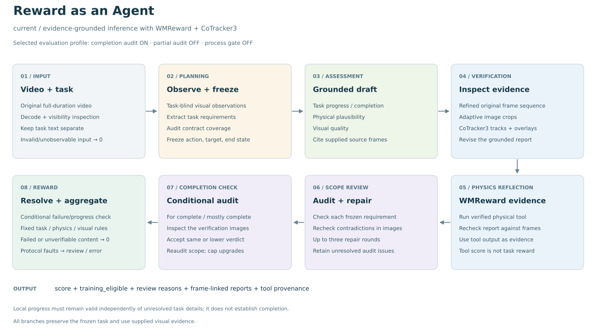
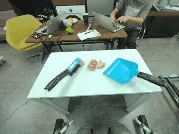
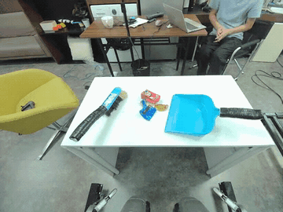
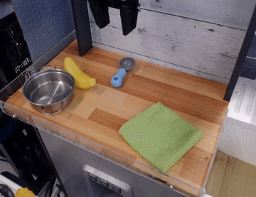
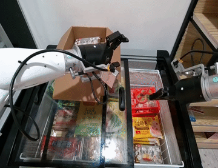
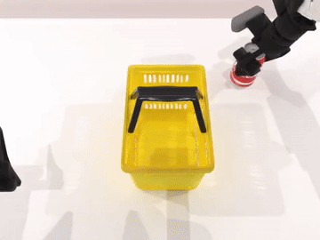
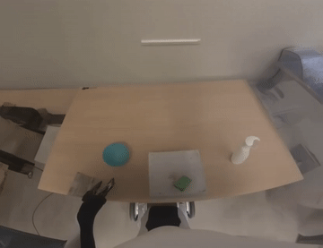
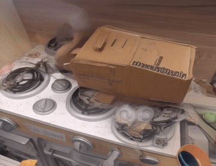

<h1 align="center">Reward as An Agent for Embodied World Models</h1>

<p align="center">
  <a href="https://arxiv.org/abs/2606.19990">📄 Paper</a> ·
  <a href="#quick-start">🚀 Quick Start</a> ·
  <a href="#demo-videos">🎬 Demos</a> ·
  <a href="#citation">📝 Citation</a>
</p>

A multimodal reward agent that evaluates task progress, physical plausibility, and visual quality in embodied world-model rollouts. Supports Doubao/Volcengine Ark and OpenAI-compatible backends.

## Framework



- **Planning:** describe video evidence without task text, then extract, coverage-audit and freeze the task requirements.
- **Assessment and verification:** assess task progress, physics and visual quality; verify refined original frames with adaptive crops and CoTracker3 motion evidence.
- **Physics and scope review:** incorporate WMReward evidence through visual Reflection, audit requirement scope, and repair image-grounded contradictions with at most three repair rounds per audit loop.
- **Completion audit:** for `complete` or `mostly_complete` reports, recheck the verification images. Accept only the same or a lower verdict, then reaudit scope; later repairs cannot exceed the accepted audit verdict.
- **Reward:** conditionally resolve failure independence and useful local progress, then apply fixed reward rules. Failed or unverifiable video content receives zero when evaluator checks permit a valid reward; unresolved protocol/audit problems require review, and execution failures remain errors.

[Framework diagram (SVG)](assets/reward_as_agent_framework.svg) · [Diagram generator](scripts/render_framework.py)

WMReward supplies physical evidence, and CoTracker3 supplies image-plane motion evidence. Neither tool directly determines task success. Additional tools can use the [worker interface](scripts/frozen_v41/worker_client.py) and [evidence hook](scripts/frozen_v41/physics_integration.py).

## Doubao + WMReward + CoTracker3 profile

The profile uses completion audit and external visual tools. No local Qwen model or vLLM server is required. [Profile](configs/doubao_full.json).

| Setting | Demonstrated behavior |
| --- | --- |
| Provider / model endpoint | Doubao Ark / deployment ID configured in `.env` |
| Sampling | Temperature 0; non-thinking generation |
| Initial visual evidence | 32 original frames, followed by verification and adaptive crops |
| Output budget | Configured 8192; `EvidencePipeline` caps requests at **4096** |
| Concurrency | Service limit 8; demo runner at most 2 concurrent videos |
| Tools | Required WMReward inference and Reflection; CoTracker3 motion evidence |
| Scope repair | At most 3 repair rounds per audit loop |
| Completion audit | `REWARD_COMPLETION_AUDIT=1` |
| Partial audit | `REWARD_PARTIAL_AUDIT=0`; conditional local-progress resolution remains active |
| Process policy | `REWARD_GATE_POLICY=off`; native failure/video-uncertainty scoring remains active |
| Physical completion | `required` |

Set the audit flags explicitly when reproducing this profile; the Python runtime's unset completion-audit flag defaults to off. Choose an available GPU on your host.

## Quick Start

Requires Python 3.10+, a model endpoint, and a CUDA environment for [WMReward](#wmreward-deployment) and [CoTracker](#cotracker-deployment).

```bash
python -m pip install -e .
cp .env.example .env
# Configure Ark credentials, WMReward and CoTracker paths in .env.

# For an existing .env, explicitly enable the completion-audit profile:
# REWARD_COMPLETION_AUDIT=1, REWARD_PARTIAL_AUDIT=0, REWARD_SCOPE_REPAIRS=3
bash start_evidence_reward.sh
```

`start_evidence_reward.sh` and `start_doubao_reward.sh` both launch the current
repository implementation. Read credentials from `ARK_API_KEY_FILE`; do not put
secrets in Git. Configure working outbound access to Ark; a temporary relay on
one host is not a portable deployment dependency.

See [.env.example](.env.example) for configuration. The service loads WMReward at startup and requires tool-backed Reflection; missing tools or tool failures never silently fall back to model-only evaluation.

Evaluate a video accessible to the server:

```bash
curl -N http://127.0.0.1:7024/eval_video \
  -H "Content-Type: application/json" \
  -d '{"video_path":["/absolute/path/video.mp4"],"prompt":"Place the cube in the bowl.","return_details":true}'
```

`POST /eval_video` streams JSONL results. `GET /health` reports worker readiness.

## Demo Videos

The repository includes video inputs and prompts for exercising the service. Run the demo client to generate results locally; generated outputs are not committed.

| Demo | Preview | Input |
| --- | --- | --- |
| Sweep a carton and peel | [](examples/demo_06/video.mp4) | [prompt and request](examples/demo_06/) |
| Sweep several pieces of litter | [](examples/demo_07/video.mp4) | [prompt and request](examples/demo_07/) |
| Cloth manipulation | [](examples/demo_01/video_1.mp4) | [prompt and request](examples/demo_01/) |
| Refrigerator drawer opening | [](examples/demo_02/video_1.mp4) | [prompt and request](examples/demo_02/) |
| Basket handle grasping | [](examples/demo_03/video_0.mp4) | [prompt and request](examples/demo_03/) |
| Green cube placing | [](examples/demo_04/video_0.mp4) | [prompt and request](examples/demo_04/) |
| Box relocation | [](examples/demo_05/video_0.mp4) | [prompt and request](examples/demo_05/) |

With the current Doubao service running, reproduce all seven demos:

```bash
python scripts/run_demos.py --url http://127.0.0.1:7024 \
  --output runs/doubao_full_demos_NEW --jobs 2 --timeout 3600 --require-motion
```

Use a fresh output directory. Each request uses the bundled video
and unchanged task text. The runner checks WMReward completion and Reflection;
`--require-motion` additionally checks `cotracker3_motion_tool` records and
retains them as `motion.json`. A `success` status is an evaluator status, not proof
that the robot task succeeded or that the score is correct.

See the [public script index](scripts/README.md) for supported entry points.

## WMReward Deployment

Install the scoring worker in a separate CUDA environment:

```bash
git clone https://github.com/facebookresearch/WMReward.git
cd WMReward
git checkout f2af53737f64f12915f249f3ad18012e6afea1ba
git submodule update --init --recursive vjepa2
python3.10 -m venv .venv-worker
.venv-worker/bin/python -m pip install torch==2.6.0 torchvision==0.21.0 --index-url https://download.pytorch.org/whl/cu126
.venv-worker/bin/python -m pip install numpy==1.26.4 decord==0.6.0 diffusers==0.33.1 einops==0.8.1 pillow timm==1.0.20
.venv-worker/bin/python -c 'import torch, torchvision, decord; from utils import compute_vjepa_loss_sliding_window; assert torch.cuda.is_available()'
mkdir -p checkpoints
curl -L https://dl.fbaipublicfiles.com/vjepa2/vitg.pt -o checkpoints/vitg.pt
sha256sum checkpoints/vitg.pt
```

In the Reward Agent repository's `.env`, set:

```dotenv
REWARD_WMREWARD_PYTHON=/absolute/path/WMReward/.venv-worker/bin/python
REWARD_WMREWARD_REPO=/absolute/path/WMReward
REWARD_WMREWARD_CHECKPOINT=/absolute/path/WMReward/checkpoints/vitg.pt
REWARD_WMREWARD_SHA256=67129f011434e605d894e69f2c8e13d9db118deabe59d54bf6e0fa62c2c5cb8e
REWARD_WMREWARD_DEVICE=cuda:0
```

Verify the downloaded digest matches. The checkpoint is approximately 16.5 GB; allow sufficient host RAM and GPU memory with extra headroom. A compatible NVIDIA driver is required. No MAGI-1 generator weights are needed. See the [upstream installation guide](https://github.com/facebookresearch/WMReward#installation) for more details.

For standalone evaluation without an HTTP server, use [scripts/run_wmreward_demo.py](scripts/run_wmreward_demo.py) (`--help` lists worker and checkpoint options).

## CoTracker Deployment

The current backend loads **CoTracker3 scaled_offline** from a local checkout of
[co-tracker](https://github.com/facebookresearch/co-tracker) at commit
`82e02e8029753ad4ef13cf06be7f4fc5facdda4d`. Install its dependencies in the
Agent's CUDA environment. Set `REWARD_COTRACKER_REPO`,
`REWARD_COTRACKER_CHECKPOINT`, `REWARD_COTRACKER_SHA256`, and
`REWARD_COTRACKER_CACHE` in `.env` (see `.env.example`).

The checkout must contain `SOURCE_MANIFEST.json` with `commit` and
`files_sha256`, mapping source-relative filenames to their SHA256 values.
The backend verifies those files before loading the model. The current
`scaled_offline.pth` checkpoint SHA256 is
`2670d4562ed69326dda775a26e54883925cd11b6fc9b24cb7aa9f8078bce7834`.
For a fresh checkout, run the following in the Agent CUDA environment (the
checkpoint URL is also listed by the pinned upstream `hubconf.py`):

```bash
git clone https://github.com/facebookresearch/co-tracker.git
cd co-tracker
git checkout 82e02e8029753ad4ef13cf06be7f4fc5facdda4d
python -m pip install -e .
python -m pip install matplotlib flow_vis tqdm tensorboard
mkdir -p checkpoints
curl -L https://huggingface.co/facebook/cotracker3/resolve/main/scaled_offline.pth -o checkpoints/scaled_offline.pth
sha256sum checkpoints/scaled_offline.pth
python - <<'MANIFEST'
import hashlib, json, pathlib, subprocess
root = pathlib.Path('.')
names = subprocess.check_output(['git', 'ls-files', '-z']).decode().split('\0')
files = {n: hashlib.sha256((root / n).read_bytes()).hexdigest()
         for n in names if n and (root / n).is_file()}
manifest = {'commit': subprocess.check_output(['git', 'rev-parse', 'HEAD']).decode().strip(),
            'files_sha256': files}
(root / 'SOURCE_MANIFEST.json').write_text(json.dumps(manifest, indent=2))
MANIFEST
```

Verify the checkpoint digest against the value above before launching. This
installation recipe follows the pinned source; this refresh reused the existing
validated tool environment rather than testing a fresh installation.

Use a writable cache directory. Keep `REWARD_MOTION_EVIDENCE=1` and
`REWARD_ADAPTIVE_CROP=1` for this full profile; the defaults enable both when
`REWARD_FAST_TRAINING=0`.

CoTracker runs in the Agent process on logical `cuda:0`; WMReward runs in its
separate worker. Predicted 2D tracks are supporting evidence, not contact labels,
3D physics, or proof of task success. A low track survival rate alone does not
establish a failed video.

## Reward & RL Usage

- **Complete / partial:** reward reflects supported completion or effective progress; unmet requirements do not automatically erase progress.
- **Failed:** confirmed failure without effective progress returns `0`.
- **Unclear video:** unobservable outcomes, uncertain targets, low-confidence visual evidence, and unresolved visible requirements return `score: 0`, with `training_eligible: true`. Factual uncertainty stays in the report and `video_quality_gate.reasons`; it is not relabeled as proven task failure.
- **Review flags:** inspect `review_required`, `review_reasons`, and `training_eligible`. The current HTTP adapter can emit `status: success, score: 0` even when review is required; that zero is not automatically an eligible training reward. Contract/protocol problems remain distinct from video-content uncertainty.
- **Errors:** tool or Reflection failures are not valid training results.

`status: success` means evaluation completed, not task success. For RL, use `score` only when `training_eligible: true`; retry or mask review/error samples. `diagnostic_score` and WMReward's raw surprise are not replacement rewards. Trainer-side masking is not implemented here, and reward calibration/stable RL suitability remains unvalidated. Exact rules: [training_reward.py](reward_as_agent/training_reward.py).

## Development

```bash
python -m pytest -q tests
```

## Citation

```bibtex
@misc{li2026rewardagentembodiedworld,
  title={Reward as An Agent for Embodied World Models},
  author={Pu Li and Zhigang Lin and Qiang Wu and Yongxuan Lv and Fei Wang and Shan You},
  year={2026},
  eprint={2606.19990},
  archivePrefix={arXiv},
  primaryClass={cs.AI},
  url={https://arxiv.org/abs/2606.19990}
}
```

When using the external-tool integration, also cite [WMReward](https://arxiv.org/abs/2601.10553) and [V-JEPA 2](https://arxiv.org/abs/2506.09985). External code and weights are not redistributed here; follow [WMReward's CC BY-NC 4.0 license](https://github.com/facebookresearch/WMReward) and [V-JEPA 2's code/model license terms](https://github.com/facebookresearch/vjepa2).
